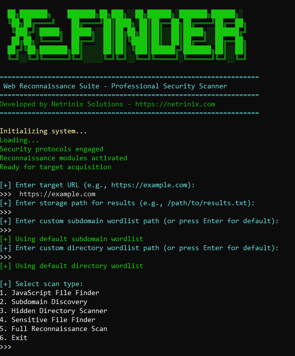

<p align="center">
  
</p>

<h1 align="center">XE-Finder 🔍</h1>
<p align="center">Professional Information & Security Scanner by Netrinix Solutions</p>

<p align="center">
  
  
  
</p>

---

## 🧠 Overview

**XE-Finder** is a professional web reconnaissance suite developed by [Netrinix Solutions](https://netrinix.com). Designed for penetration testers and researchers, this modular tool performs deep analysis of target domains to uncover **vulnerabilities, subdomains, sensitive files, JavaScript endpoints**, and more.

> 📌 Ideal for: Bug hunters · Security auditors · Red teamers



---

## 🚀 Key Features

- 🔎 JavaScript File Discovery  
- 🌐 Subdomain Enumeration  
- 📁 Hidden Directory Scanning  
- 🧾 Sensitive File Detection  
- 🧠 Full Reconnaissance Mode  
- 📄 Custom Wordlist Support  
- 💾 Export Scan Results  

---

## 📂 Scan Modules

| Module | Function |
|--------|----------|
| **JavaScript Finder** | Detects all JS files & paths |
| **Subdomain Discovery** | Brute-forces hidden subdomains |
| **Directory Scanner** | Locates hidden folders |
| **Sensitive File Search** | Detects exposed secrets/backups |
| **Full Recon** | Runs all modules sequentially |

---

## 📊 Sample Output

[+] Found JS Files:

    https://example.com/main.js

    https://example.com/util.js

[+] Subdomains:

    www.example.com

    dev.example.com

[+] Sensitive Files:

    https://example.com/.env

    https://example.com/db-backup.zip


---

## 📁 Wordlists

Default curated wordlists included:

- `wordlists/subdomains.txt`  
- `wordlists/directories.txt`  

Custom wordlists can be specified via CLI options.

---

## 💬 Example Commands

```bash
# Interactive mode
python scanner.py

# Full scan with output
python scanner.py -u https://target.com -o result.txt --full-scan

# Run specific module
python scanner.py -u https://target.com -m subdomain

🤝 Contributing

We welcome community contributions!

# Fork & create your feature branch
git checkout -b feature/amazing-feature

# Make changes & commit
git commit -am 'Add amazing feature'

# Push & open pull request
git push origin feature/amazing-feature

Ensure code follows PEP8 and includes proper testing.
⚖️ License

This project is licensed under the MIT License.
⚠️ Disclaimer

This tool is intended for educational and authorized penetration testing only.
Do not scan systems without proper permission.
🧠 About Netrindx Solutions

Netrinixx Solutions is a cybersecurity firm focused on red teaming, education, and infosec innovation. Our team builds high-impact tools for ethical hackers & enterprises.
